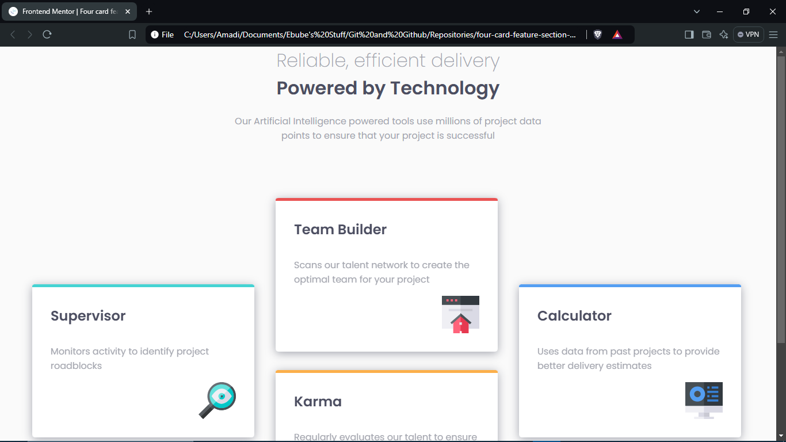
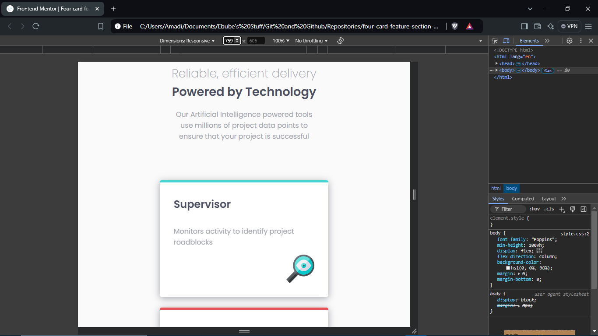

# Frontend Mentor - Four card feature section solution

This is a solution to the [Four card feature section challenge on Frontend Mentor](https://www.frontendmentor.io/challenges/four-card-feature-section-weK1eFYK). Frontend Mentor challenges help you improve your coding skills by building realistic projects. 

## Table of contents

  - [The challenge](#the-challenge)
  - [Screenshot](#screenshot)
  - [Links](#links)
  - [Built with](#built-with)
- [Author](#author)

### The challenge

Users should be able to:

- View the optimal layout for the site depending on their device's screen size

### Screenshot

### Links

- Solution URL: [https://github.com/ebubz-dev/four-card-feature-section](https://github.com/ebubz-dev/four-card-feature-section)
- Live Site URL: [https://ebubz-dev.github.io/four-card-feature-section/](https://ebubz-dev.github.io/four-card-feature-section/)

### Built with

- Semantic HTML5 markup
- CSS custom properties
- Flexbox
- CSS Grid

## Author

- Website - [Add your name here](https://ebubz-dev.github.io)
- Frontend Mentor - [@yourusername](https://www.frontendmentor.io/profile/ebubz-dev)